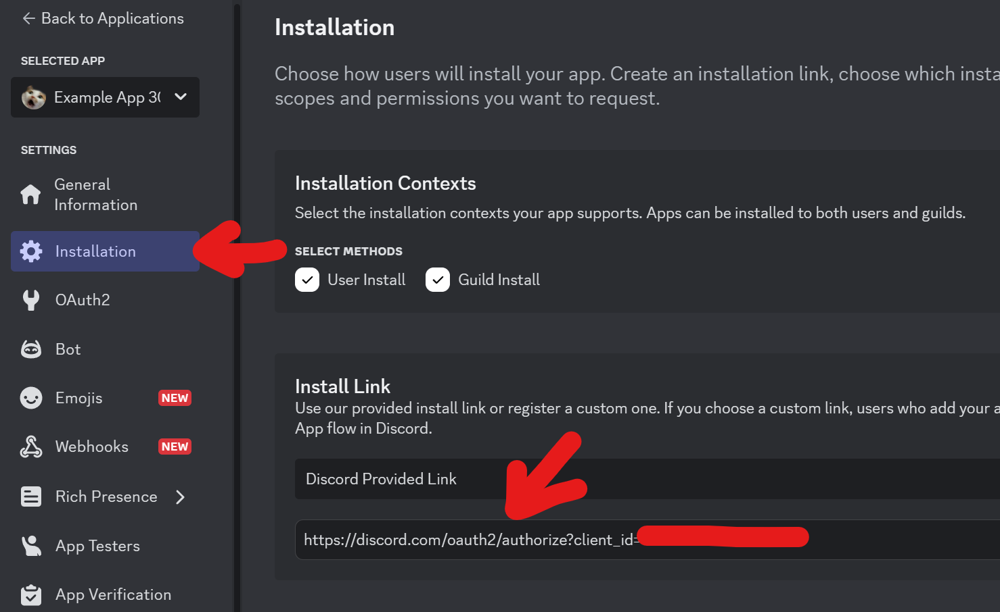

# @alexstormwood/typescript-discord-bot-demo

Example repo showcasing how to make and use a Discord bot using NodeJS and TypeScript.

## Setup

### Discord App/Bot Setup 

Follow the Discord.js documentation on creating your Discord bot: 

- https://discordjs.guide/preparations/setting-up-a-bot-application.html#creating-your-bot

You need the bot token, as well as the bot client ID.

Your own instance of this project will use both of those properties while running, to enable the bot to work.

Do NOT share the bot token with anyone! That token allows anyone to run their own bot as if it were your bot, doing whatever malicious things they wish!

This code will not work without a valid `.env` file in the root of the repository. It must contain the Token and the Client ID for the code to work.

Refer to the `.env.example` file in the project to see what your own `.env` file must contain.

Once you've gotten your bot data sorted out, you must also add the bot to a Discord server. If you haven't made your own Discord server as a testing ground or sandbox, do it! The servers are free.

Follow the Discord.js documentation on adding your Discord bot to servers:

- https://discordjs.guide/preparations/adding-your-bot-to-servers.html#bot-invite-links

Just visit this URL in your browser to kick things off, basically:

### Dependencies

Run this command when setting up or updating your copy of this repository:

`npm install`

That allows the code to function based on its dependencies.

While the bot is running, if you have registered it to a Discord server, you can use the slash commands menu to see the bot's available commands.

And then use the commands:

## Usage

Start the code using the terminal. If you have NodeJS installed, you can run:

`npm run build`

That prepares the app code to a "ready" state, compiling it.

Then, you can run:

`npm run start`

## Development

You can run the app with `npm run dev` while developing the app.

There is no `watch` or `hot-reload` command, and this is by design: Discord doesn't like it when the bot commands registered into their system are changed too often. Every time the bot runs, it updates the commands registered into Discord's system - which means any reloading for app development also triggers an update in Discord. 

There is no way around this, other than just running the app less-often - so, no watching or hot-reloading here!

## Learning

Explore the files! I've commented the important, relevant bits.

Remember: you can hold Control while clicking on a variable or path to see the source of that thing.

Holding Control while hovering over things also changes the information that you see. For example, no control held:

When Control is held and the mouse moves a bit, the intellisense pop-up changes:

You can also click through on variable names such as that `getRandomPokemon`, while holding Control, and your coding editor (e.g. Visual Studio Code) should open up the source file containing that variable's declaration. Using that trick, you can peruse through the entire chain of whatever variables, types, functions, and so on, are in use in whatever you're analysing!